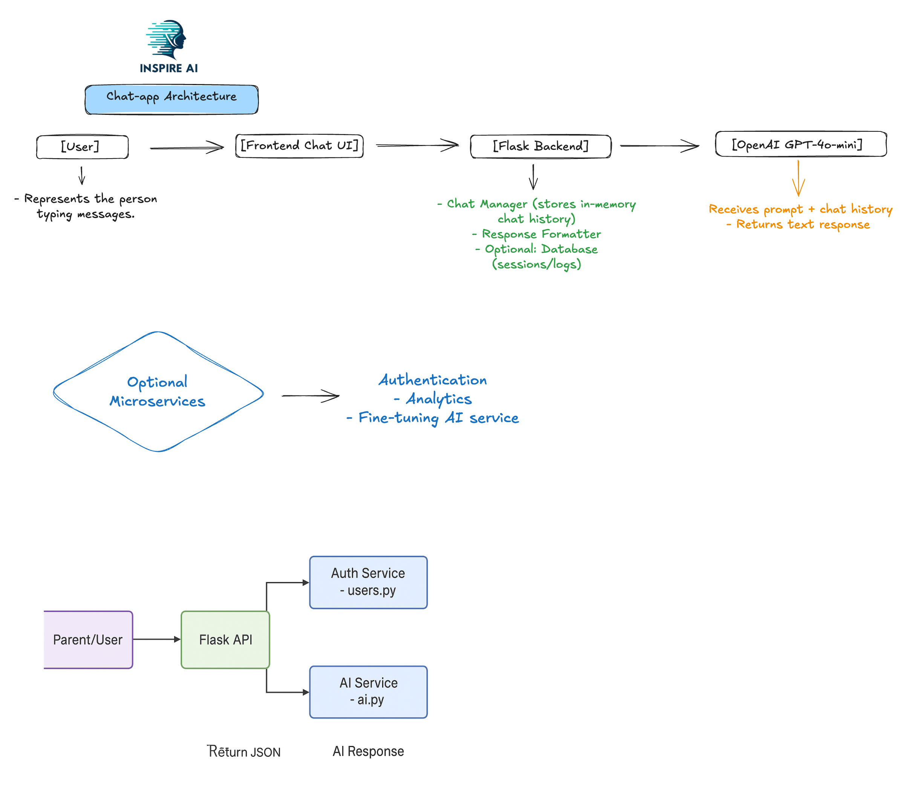
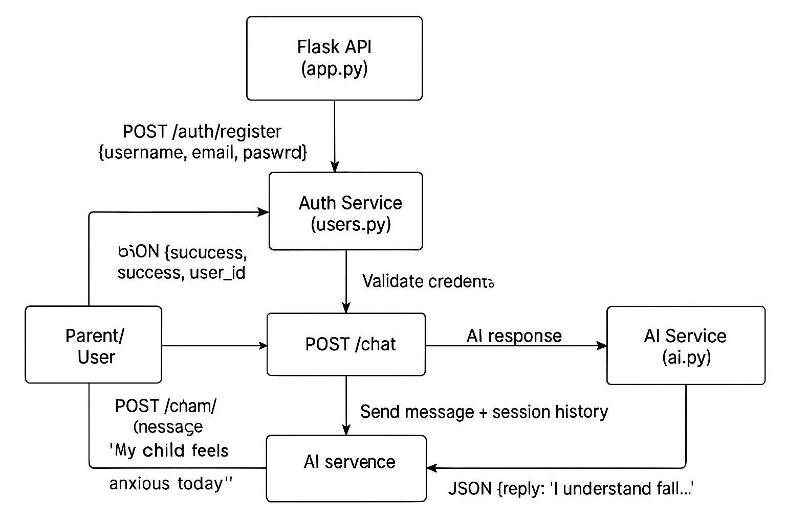

# Inspire AI 🌿

[](https://www.python.org/)
[](https://openai.com/)
[](LICENSE)

---

## 🌟 Description

AI-powered chat assistant for parents of children with mental health challenges, providing daily support, guidance, and motivation.

---

## 📚 Table of Contents

- [Overview](#overview)
- [Features](#features)
- [Architecture](#architecture)
- [Data Flow](#data-flow)
- [Setup & Installation](#setup--installation)
- [Environment Variables](#environment-variables)
- [Running the App](#running-the-app)
- [API Endpoints](#api-endpoints)
- [Development & Deployment](#development--deployment)
- [Future Improvements](#future-improvements)

---

## 🧐 Overview

Inspire AI 🌿 is a backend service that provides an **empathetic, supportive AI chat assistant** for parents of children with serious mental health conditions. It helps parents:

- Stay motivated and consistent in daily caregiving
- Track small improvements in the child’s behavior
- Receive positive reinforcement and micro-guidance
- Use a session-based chat with personalized AI responses

The AI agent uses **OpenAI GPT models** with enhanced prompts to maximize empathy, positivity, and practical advice.

---

## ⚡ Features

- AI chat with **session-based history per user**
- Empathy-driven **system prompt** for consistent tone
- Randomized **supportive phrases** to avoid repetition
- **REST API** with Swagger documentation
- User authentication (register/login)
- Microservices-ready architecture
- Easily **updatable AI logic** as training progresses

---

## 🏗 Architecture

### Modules

| Module | Responsibility |
|--------|----------------|
| `services/users.py` | User authentication and management |
| `services/ai.py` | AI response generation with chat history |
| `app.py` | Main Flask REST API with namespaces for auth and chat |

### Microservices-Ready

- AI chat is a **standalone service** (`ai.py`) and can integrate with other services
- Future modules (notifications, analytics, etc.) can be added without touching the AI logic

---

## 🔄 Data Flow

```mermaid
flowchart LR
    A["Parent/User"] -->|POST /auth/login or /register| B["Flask API"]
    B --> C["Auth Service - users.py"]
    B --> D["AI Service - ai.py"]
    D -->|AI Response| B
    B -->|Return JSON| A

📂 Documentation & Visuals

### System Architecture


### Example Chat Flow


### Microservices & Service Interactions



⚙️ Setup & Installation
git clone https://github.com/<your-username>/inspire-ai-chat.git
cd inspire-ai-chat

# Create virtual environment
python -m venv venv
source venv/bin/activate  # macOS/Linux
venv\Scripts\activate     # Windows

# Install dependencies
pip install -r requirements.txt


🔑 Environment Variables

Create a .env file in the root directory:

OPENAI_API_KEY=<your_openai_api_key>
FLASK_SECRET_KEY=<your_flask_secret_key>


▶️ Running the App
python app.py


Swagger UI: http://127.0.0.1:5001/swagger

Chat endpoint: POST /chat/

Auth endpoints: POST /auth/register and POST /auth/login
